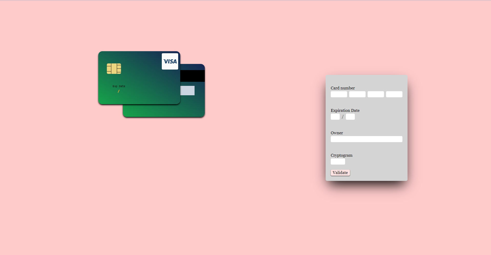
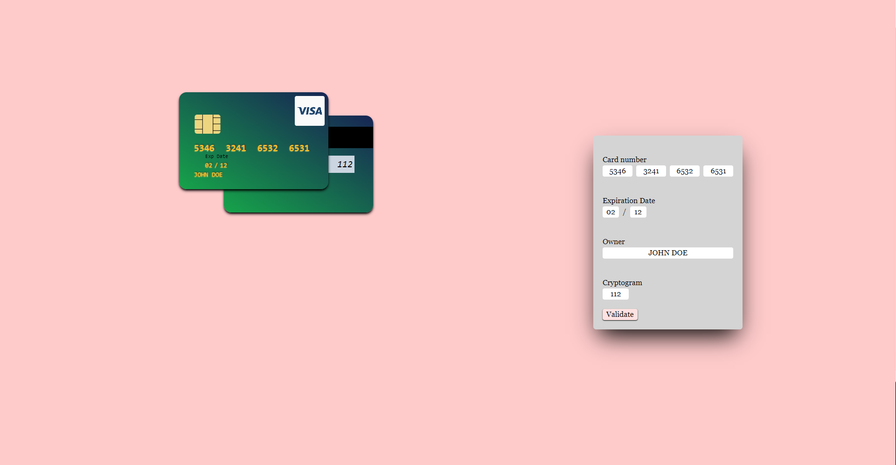

# Credit-card-checkout

## Fr

### Description

Formulaire d'entré de coordonées bancaire dynamique.

### Détails

Salut, voici ma version d'entrée de coordonées bancaire. C'est mon premier projet avec tailwind donc soyez indulgent.
Il a été réalisé en HTML, tailwindcss et javascript.

Vous pouvez le visiter [ici](https://seblau02.github.io/credit-card-checkout/)

## En

Hello, here is my credit card checkout version.
It was made using HTML, tailwindcss and Javascript.
It's my firstime with tailwind so be lenient.

You can visit it [here](https://seblau02.github.io/credit-card-checkout/)

### Technologies: HTML, CSS, Javascript

### Images

